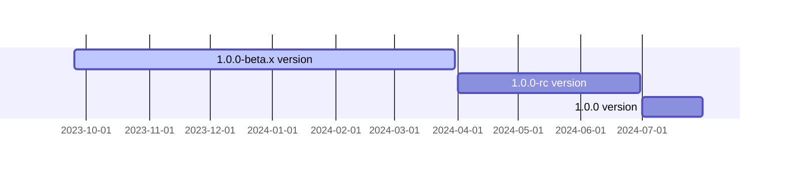

<p align="center">
  <a href="https://opentiny.design/tiny-engine" target="_blank" rel="noopener noreferrer">
    
  </a>
</p>
<p align="center">TinyEngine Web Service is a RESTful API responsible for providing data services, code generation services, and code release services to the front end.  It does not directly operate on the database, and data operations request interfaces from TinyEngine Data Center.</p>


English | [简体中文](README.zh-CN.md)

### Directory Rules

Before development, you need to understand the overall directory structure of the project and compile code according to the following rules

```
├── README.md
├── app
│   ├── controller                      // controller
│   │   └── service controller                    // Create a service folder for a specific service. For a public service, name the folder common
│   │       ├── api.js                  // api file processes interface-related logic
│   │       └── page.js                 // page file mainly processes the page logic
│   ├── extend
│   │   └── helper.js                   //  controller can be extracted to the helper and referenced by this.ctx.helper.xxx
│   ├── middleware                      // This part of middleware must be public logic. (For multi-language processing, remember to distinguish between JSON and HTML.) The service logic is not stored in the middleware. The common processing logic can be defined in the helper based on the service space
│   ├── public                          // Static file directory. Resources in the directory can be accessed in /public/ mode during local development. However, you need to configure the /public/ permission at the gateway layer on the release line. (It is recommended that static resources be stored in CDN.)
│   │   └── Static resource of the service                // The static directory also needs to distinguish specific service types by folder. Here, doc is the service of the document center, and the Zhishi folder is created in the knowledge base
│   │       ├── css
│   │       ├── images
│   │       └── js
│   ├── router                          // Routes are divided based on services. All routes must have their own service prefixes. Other services except common services do not use the / * global route. Instead, the / service name / * route is used to process the logic of their own services
│   │   ├── common.js                   // The common JS is used to process routing under the root directory /*. Other service logic cannot be placed in the common JS
│   │   └── Service route.js
│   ├── service                         // The service is the same as the controller. The service is divided based on the service
│   │   └── Service-related backend interface services         // Interfaces used for interconnection with the backend are classified based on services
│   │       └──Interface logic of the specific service on which the service depends.js
│   └── view                            // The view stores the ejs template. The file directory is divided based on the service. (Divide different templates according to the language directory under the service) , where common and error are common layout and error handling respectively
│       ├── common                      // Common stores public layout files (such as header, footer, and sidecar). Each service can include the files to its own service as required.
│       │   ├── en-us                   // Template for public English
│       │   │   └── index.tpl
│       │   └── zh-cn                   // Public Chinese Template
│       │       ├── footer.tpl
│       │       └── header.tpl
│       ├── Service template                // Service template of the document center
│       │   ├── en-us
│       │   │   └── index.tpl
│       │   └── zh-cn
│       │       ├── 404.html
│       │       ├── content
│       │       │   ├── catalog.tpl
│       │       │   └── content.tpl
│       │       └── pages.tpl
│       └── error                        // he error directory stores error processing files. For example, errors such as 404 500 can be placed in the directory and are divided by language
│           ├── en-us
│           │   └── 404.tpl
│           └── zh-cn
│               └── 404.tpl
├── config                               // Different project configurations are loaded based on different environments
│   ├── config.default.js                // This file is the default configuration file. After being defined in other config files, the file will be combined in Object.assig(config.defalut.js, config.xxxx.js) mode based on the environment. Therefore, all common configurations of different environments are combined here, and other configurations can be customized
│   ├── config.local.js                  // You only need to configure local differentiated configurations
│   ├── config.prod.js
│   └── plugin.js                       // Plug-in switch directory. You can switch plug-ins based on the site requirements
├── logs                                // Output directory of local development logs
├── package.json
├── test                                // Compile test cases in BDD mode
│   └── Service Test Cases                      // Service-related test cases
│        ├── controller.test.js         // Test by language/Test by whether the interface is 200
│        └── service.test.js            // Use the assert assertion library to test whether the interface returned by the service is normal
└── typings                             // Egg uses the typescript to temporarily generate some definition files, which can be ignored during routine development
```


### Interface Return Specifications

##### 1.Return Format

- Correct data
```js
{
    "locale": "zh-cn",
    "data": {
      "app": {
        "count": 100
      }
    }
}
```
- Error Data
```js
{
    "locale": "zh-cn",
    "data": {},
    "error": {
      "code": "CM002",
      "message": "name 不能为空",
    }
}
```
##### 2.How to Ensure the Accuracy of Error Codes and Error Information

- The Egg interface is normal. The HTTP status code is 200 except that the service layer returns 403 for re-login. The exception cause is error.
- Entry internationalization: The corresponding error code and entry content are continuously added to the config/locale file.
- Do not request the data-center interface and directly invoke helper.commonJson() to return data.
- Request the interface of the data center:
```js
// Invoke the corresponding service method to initiate a query request. The dataService invokes helper.getResponseData().
// getResponseData: normalizes and converts the error information returned by the data center.
const createRes = await platforms.createPlatform(body);
// If the common error message does not contain the field, reprocess the obtained data.
// The formatResponse can be logically extended.
this.ctx.body = this.ctx.helper.formatResponse(createRes, 'name');
```
##### 3.Parameter field validation

- Use validate to verify the field necessity and format at the egg service layer interface to prevent this error from being thrown in the strapi. If there are special requirements on the data format, add rules in app/validate.

##### 4.error-handling middleware

- Add error interception processing to the middleware errorResponse.ts. Exceptions caused by the server will be captured and 500 will be returned. Exceptions thrown by other middleware will be added based on the error content.

### Instruction Manual

For specific server usage documentation, please see [TinyEngine Official Website - User Manual](https://opentiny.design/tiny-engine#/help-center/course/backend/51)

### development

#### Environment Variables

|Variable name|Description
|---|---|
|GIT_USERNAME|Code repository user name with push code permission when the application is published|
|GIT_EMAIL|The email address of the user who has push code permissions in the code repository when the application is published|
|GIT_USER_TOKEN|Code repository token with push code permission when the application is published|
|GIT_REPO|Code repository address when the application is released|
|GIT_BRANCH|The branch where the code is submitted by default when the application is released|
|DATA_CENTER_URL|Data center address, for example:https://www.mydatacenter.com|
|PROXY_SERVER|Selective setting.  If your server requires proxy services to access external data, you need to configure the address of the proxy service|
|OPENAI_API_KEY|API key for openai AI interface|
|WENXIN_ ACCESS_ TOKEN | Access to the AI interface ERNIE Bot_ token (updated every 30 days)|
|NPM_AUTH_TOKEN|The authToken of npmjs.com users with publish permission, which is used to publish blocks|

The following are the configuration items for reference environment variables:
obs configuration
This open source code provides usage examples for pairing with Huawei Cloud OBS:

|Variable name|Description
|---|---|
|OBS_AK|obs AK This sample code uses Huawei Cloud obs. If you use other cloud service products, please search for relevant code modification logic to adapt it.
|OBS_SK|obs SK This sample code uses Huawei Cloud obs. If you use other cloud service products, please search for relevant code modification logic to adapt it.
|OBS_ACCESS_URL|obs resource access url, for example:https://tinyengine.obs.cn-north-4.myhuaweicloud.com/somepath/somefile.tar.gz|
|OBS_SERVICE_URL|The obs service link parameter passed in when using the obs sdk, for example:https://obs.cn-north-4.myhuaweicloud.com|

RabbitMQ configuration

This open source code provides an example of using RabbitMQ to connect to a task queue (the RabbitMQ plugin in the open source code is turned off. If necessary, please turn it on. Also restore the commented code in app.ts in the project root directory):

|Variable name|Description
|---|---|
|MQ_IP| The IP address of the task queue service|
|MQ_PORT|The task queue service port, for example, 5671|
|MQ_USERNAME|Task queue service user name|
|MQ_PASSWORD|	Task queue service password|

If CI/CD deployment or containerized deployment of your own service is involved, please configure environment variables according to the characteristics of your own product and tool based on the above list;

#### Local Runtime Configuration Method:

git-bash or bash
```
vi ~/.bashrc
```
```
export MQ_IP=192.168.0.11
export MQ_PORT=5671
# Wait for environment variables
```
After setting, reopen the command line or execute it in the current command line
```
source ~/.bashrc
```
Make the set environment variables take effect;(The environment variables set in git bash cannot be applied to powershell and cmd)
Start project
nodejs version selection: >= 16
Go to the root directory of the project and execute it once:

```
yarn install --ignore-engines
npm run dev
```

### Milestones



### 🤝 Participating in contributions

If you are interested in our open source project, please join us!

Please read the Contribution Guide (CONTRIBUTING.zh-CN.md) before participating in the contribution.

- Add official assistant WeChat opentiny-official and join the technical exchange group
- Join the mailing list opentiny@googlegroups.com

### Open source protocol

[MIT](LICENSE)
