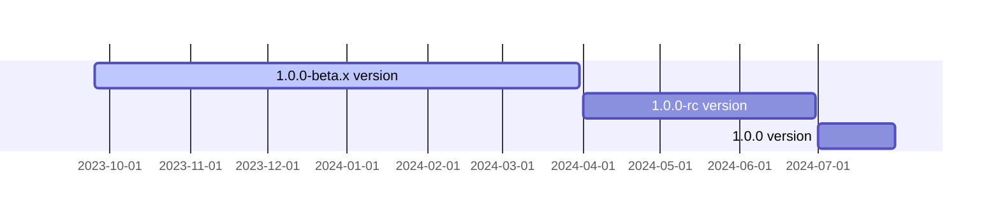

<p align="center">
  <a href="https://opentiny.design/tiny-engine" target="_blank" rel="noopener noreferrer">
    
  </a>
</p>

<p align="center">TinyEngine低代码引擎使能开发者定制低代码平台，支持在线实时构建低码平台，支持二次开发或集成低码平台能力</p>

[English](README.md) | 简体中文

### 目录规则

开发前需要了解项目整体目录结构，并按照如下规则去进行目录规则编写代码

```
├── README.md
├── app
│   ├── controller                      // controller
│   │   └── 业务控制器                    // 具体哪个业务建立自己的业务文件夹，如果是公用业务请把这个文件夹命名common
│   │       ├── api.js                  // api文件主要处理接口相关的逻辑
│   │       └── page.js                 // page文件主要处理页面的逻辑
│   ├── extend
│   │   └── helper.js                   // controller中的所有公共方法可以抽到helper里面通过 this.ctx.helper.xxx 引用
│   ├── middleware                      // 这部分中间件必须是公共逻辑(多语言处理之类的，记得要根据json还是html进行区分处理)，业务逻辑不要放到中间件里面，各自业务公共方法可以在helper里面分自己业务空间定义通用的处理逻辑
│   ├── public                          // 静态文件目录，里面的资源本地开发阶段可以通过/public/方式访问到，但是发布线上记得要在网关层进行配置/public/目前的权限（这里建议静态资源放到cdn）。
│   │   └── 业务的静态资源                // 静态目录也要通过文件夹区分具体的业务类型，这里doc是文档中心的业务，知识库则建立zhishi文夹
│   │       ├── css
│   │       ├── images
│   │       └── js
│   ├── router                          // 路由根据业务进行划分，所有路由都必须要有自己业务前缀，除了common通用处理以外其他业务禁止使用/*这种全局路由，而采用/业务名称/*这种路由来处理各自业务下的逻辑
│   │   ├── common.js                   // common这个js主要处理根目录/*下路由等情况，其他业务逻辑禁止放到这里面
│   │   └── 业务的路由.js
│   ├── service                         // service跟controller同理，根据业务划分。
│   │   └── 业务相关的后端接口服务          // 业务中使用到跟后端对接相关接口，根据业务划分
│   │       └── 业务所依赖的具体服务的接口逻辑.js
│   └── view                            // view存放的是ejs模版，根据业务具体划分文件目录（业务下再根据语言目录划分不同模版），其common和error分别为公共布局以及错误处理。
│       ├── common                      // common存放公共布局文件（header/footer/sidecar等），各个业务可以在自己需要的时include进到自己业务中
│       │   ├── en-us                   // 公共英文的模版
│       │   │   └── index.tpl
│       │   └── zh-cn                   // 公共中文的模版
│       │       ├── footer.tpl
│       │       └── header.tpl
│       ├── 业务自己的模版                 // 文档中心的业务模版
│       │   ├── en-us
│       │   │   └── index.tpl
│       │   └── zh-cn
│       │       ├── 404.html
│       │       ├── content
│       │       │   ├── catalog.tpl
│       │       │   └── content.tpl
│       │       └── pages.tpl
│       └── error                        // error目录存放错误处理文件，如404 500这种错误可以放到这里面来，同时也会根据语言进行划分
│           ├── en-us
│           │   └── 404.tpl
│           └── zh-cn
│               └── 404.tpl
├── config                               // 项目配置 根据不同环境会加载不同配置
│   ├── config.default.js                // 这个文件主要是默认配置，是其他config文件定义之后根据环境不同会通过Object.assig(config.defalut.js,config.xxxx.js)方式合并。所以不同环境公共的配置全合并到这里，其他config做自己定制化处理即可。
│   ├── config.local.js                  // 只需要配置本地相关的一些差异化配置
│   ├── config.prod.js
│   └── plugin.js                       // 插件开关目录，根据实际需要去开关自己的插件
├── logs                                // 本地开发日志的输出目录
├── package.json
├── test                                // 测试用例，采用BDD方式进行测试用例编写
│   └── 业务测试用例                      // 业务相关测试用例
│        ├── controller.test.js         // 根据语言维度进行测试/根据接口是否200进行测试
│        └── service.test.js            // 根据服务返回接口是否正常，通过assert断言库进行测试
└── typings                             // egg使用typescript临时生成的一些定义文件，日常开发可以忽略。
```


### 接口返回规范
##### 1.返回格式
- 正常数据
```js
{
    "locale": "zh-cn",
    "data": {
      "app": {
        "count": 100
      }
    }
}
```
- 错误数据
```js
{
    "locale": "zh-cn",
    "data": {},
    "error": {
      "code": "CM002",
      "message": "name 不能为空",
    }
}
```
##### 2.如何保证错误码和错误信息准确性
- egg接口走通，除业务层返回403重登录外，http状态码均为200，异常原因体现在error；
- 词条国际化：在config/locale 中持续补充对应错误码和词条内容
- 不请求data-center的接口，直接调用helper.commonJson()返回数据
- 请求data-center的接口：
```js
    // 调用对应service方法，发起query请求，dataService会调用helper.getResponseData()
    // getResponseData会将data-center回传的错误信息进行规范化转换
    const createRes = await platforms.createPlatform(body);
    // 如果通用的错误提示不能体现出字段，可对已经获得数据再加工
    // formatResponse可进行逻辑扩展
    this.ctx.body = this.ctx.helper.formatResponse(createRes, 'name');
```
##### 3.参数字段校验
- 在egg服务层接口使用validate进行字段必要性和格式校验，避免这种错误在strapi抛出，对数据格式有特殊要求的可以在app/validate添加规则

##### 4.错误处理中间件
- 在中间件errorResponse.ts中补充错误拦截处理；服务端本身导致的异常会捕获并返回500, 其他中间件等抛出的异常根据错误内容添加
### 开发
安装所需的依赖

```
$ npm install
```
本地开发配置文件修改
* tiny-engine-webservice 根目录config文件夹下config.local.ts 文件中，修改config.dataCenter配置为自己数据库服务配置
* tiny-engine-webservice 根目录config文件夹下config.default.ts 文件中 修改相关obs配置为自己的云存储服务配置，修改config.amqplib为自己的mq服务配置（不用可删除相关配置及代码），修改config.aiChat为自己的ai大模型服务配置

启动项目
```
$ npm run dev
```
### 里程碑


### 🤝 参与贡献

如果你对我们的开源项目感兴趣，欢迎加入我们！🎉

参与贡献之前请先阅读[贡献指南](CONTRIBUTING.zh-CN.md)。

- 添加官方小助手微信 opentiny-official，加入技术交流群
- 加入邮件列表 opentiny@googlegroups.com

### 开源协议

[MIT](LICENSE)
