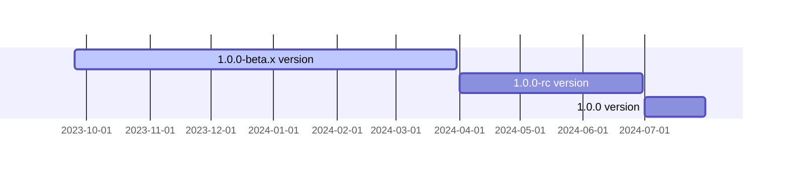

<p align="center">
  <a href="https://opentiny.design/tiny-engine" target="_blank" rel="noopener noreferrer">
    
  </a>
</p>
<p align="center">TinyEngine enables developers to customize low-code platforms, build low-bit platforms online in real time, and support secondary development or integration of low-bit platform capabilities.</p>


English | [简体中文](README.zh-CN.md)

### development
Dependencies required for installation

```
$ npm install
```

Start a project
```
$ npm run dev
```
### Milestones



### 🤝 Participating in contributions

If you are interested in our open source project, please join us!

Please read the Contribution Guide (CONTRIBUTING.zh-CN.md) before participating in the contribution.

- Add official assistant WeChat opentiny-official and join the technical exchange group
- Join the mailing list opentiny@googlegroups.com

### Open source protocol

[MIT](LICENSE)
