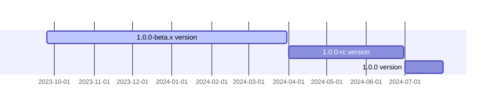

<p align="center">
  <a href="https://opentiny.design/tiny-engine" target="_blank" rel="noopener noreferrer">
    
  </a>
</p>

<p align="center">TinyEngine低代码引擎使能开发者定制低代码平台，支持在线实时构建低码平台，支持二次开发或集成低码平台能力</p>

[English](README.md) | 简体中文

### 开发
安装所需的依赖

```
$ npm install
```

启动项目
```
$ npm run dev
```
### 里程碑


### 🤝 参与贡献

如果你对我们的开源项目感兴趣，欢迎加入我们！🎉

参与贡献之前请先阅读[贡献指南](CONTRIBUTING.zh-CN.md)。

- 添加官方小助手微信 opentiny-official，加入技术交流群
- 加入邮件列表 opentiny@googlegroups.com

### 开源协议

[MIT](LICENSE)
